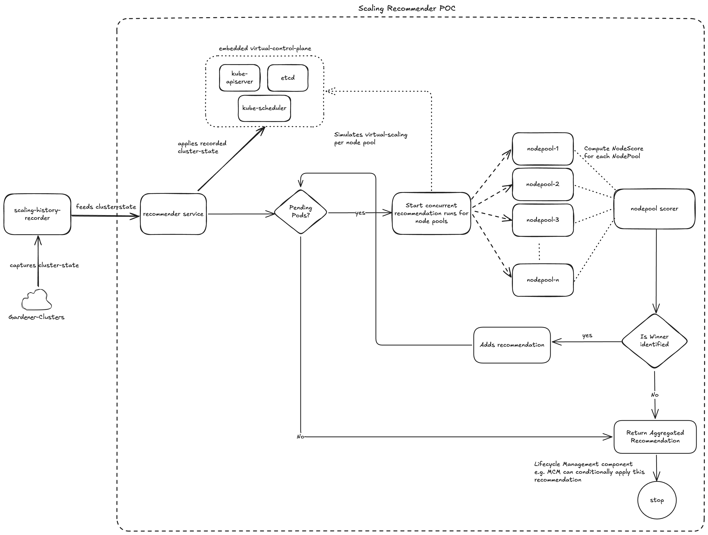

# Scaling Recommender Motivation

## Summary

Gardener uses a [fork](https://github.com/gardener/autoscaler/tree/machine-controller-manager-provider/cluster-autoscaler) of upstream [Cluster-Autoscaler](https://github.com/kubernetes/autoscaler/tree/master/cluster-autoscaler) (a.k.a CA) to scale out/in Shoot clusters and it uses [machine-controller-manager](https://github.com/gardener/machine-controller-manager) (a.k.a MCM) to manage the lifecycle of machines. In the CA fork we have an in-tree implementation of [CloudProvider](https://github.com/gardener/autoscaler/blob/45e190f4bd7890e0029bef8eb9affa0946f135d5/cluster-autoscaler/cloudprovider/cloud_provider.go#L106) interface for [MCM](https://github.com/gardener/autoscaler/blob/45e190f4bd7890e0029bef8eb9affa0946f135d5/cluster-autoscaler/cloudprovider/mcm/mcm_cloud_provider.go#L69). Over several years of using these components together we have encountered numerous challenges and shortcomings when working with CA.

This proposal highlights the following:

* Challenges and the shortcomings of current CA and its interplay with MCM.
* The extensive simulation environment that was built during the POC phase which provides capabilities to capture events from any Gardener cluster and replay the events on a local kubernetes cluster with virtual CA. This helped us capture and understand current CA's behavior, identify its shortcomings and compare the recommendations against the alternative recommendation system that we evaluated.
* Provides a glimpse of the way forward from here.

## Motivation

Gardener provides capabilities to scale-in and scale-out a kubernetes cluster via [Cluster Autoscaler](https://github.com/gardener/autoscaler/tree/machine-controller-manager-provider/cluster-autoscaler). Consumers can tune a subset of knobs provided out of CA by configuring [ClusterAutoscaler configuration](https://github.com/gardener/gardener/blob/50828b680ca098ed33f617c5bc60bf1dce393124/pkg/apis/core/v1beta1/types_shoot.go#L599) as part of the [Shoot](https://github.com/gardener/gardener/blob/50828b680ca098ed33f617c5bc60bf1dce393124/pkg/apis/core/v1beta1/types_shoot.go#L25) resource. Based on our experience running Cluster Autoscaler and Machine Controller Manager in production environments across thousands of clusters, we have gathered valuable insights that have prompted us to reevaluate the Cluster Autoscaler component. In this document, we outline some of these observations.

### Issues & Challenges

#### Multiple Overlapping Actors:

* Having overlapping responsibilities between CA and MCM causes the following issues:
  * CA and Gardener worker reconciler updates the replicas on `MachineDeployment`  (mapped 1:1 to CA NodeGroup). [Gardener Issue](https://github.com/gardener/gardener/pull/9925) reveals the problem of having multiple actors trying to update the `MachineDeployment` replicas resulting in lost updates.
  * CA and MCM have overlapping timeouts:
    *  [machineCreationTImeout](https://github.com/gardener/gardener/blob/d395f33500d91c144202d15b9760e39a3783a973/example/90-shoot.yaml#L136C24-L136C24) and [maxNodeProvisionTime](https://github.com/gardener/gardener/blob/d395f33500d91c144202d15b9760e39a3783a973/example/90-shoot.yaml#L286) which if misconfigured can result in preventing CA from backing-off from a NodeGroup. See [issue]() and the [recommendation](https://pages.github.tools.sap/kubernetes/gardener/docs/faq/sap-internal/ca-mcm-faqs/#how-to-configure-machinecreationtimeout-and-maxnodeprovisiontime-properly) on how to correctly set these values. See *Live-Issue#6040*.
    * [machineDrainTimeout](https://github.com/gardener/gardener/blob/d395f33500d91c144202d15b9760e39a3783a973/example/90-shoot.yaml#L134) and [maxGracefulTerminationSeconds](https://github.com/gardener/gardener/blob/d395f33500d91c144202d15b9760e39a3783a973/example/90-shoot.yaml#L285) is another set of overlapping timeouts. Consumers need to always follow the [recommendation](https://pages.github.tools.sap/kubernetes/gardener/docs/faq/sap-internal/ca-mcm-faqs/#how-to-configure-machinedraintimeout-and-maxgracefulterminationseconds-properly) when setting these timeouts.
* When CA starts or restarts post a crash it will [remove](https://github.com/kubernetes/autoscaler/blob/5cd491a5a18b4b93f742351e3ebb195e358d2ea3/cluster-autoscaler/core/static_autoscaler.go#L239) previously added`ToBeDeletedByClusterAutoscaler` taints on nodes. This blind removal of taints upon restart has caused several issues which occur due to race conditions between MCM and CA. Removal of taints allows kube-scheduler to consider these nodes as target for pod deployment. If MCM is already in the process of handling the node(s) removal request, this can potentially cause downtime for the pods already deployed on those nodes.
* The Cluster Autoscaler (CA) triggers the draining of nodes marked for deletion. However, node draining is already managed by the Machine Controller Manager (MCM) for any node marked for termination. Node draining should be handled exclusively by MCM (as the sole actor), since it is closely linked to node lifecycle management, which is outside the scope of CA’s responsibilities.
* In Gardener we use the custom CloudProvider implementation that leverages MCM to do machine lifecycle management. When CA attempts to apply its scaling recommendation by invoking methods on CloudProvider, then these operations will be asynchronously executed by MCM as these are two independently deployed components.

#### CA inherent design flaws

* CA starts several go-routines calling methods on Cloud provider implementations, which can potentially lead to race conditions. One such [issue](https://github.com/gardener/autoscaler/pull/341) was identified, resulting in duplicate reduction of replicas for a MachineDeployment. This forced the developers to take a `sync.Mutex` to ensure that not more than one go-routine updates the replicas for a `MachineDeployment`. Upon reviewing other cloud provider implementations, such as `ClusterAPI`  we found they have also taken similar measures, as seen [here](https://github.com/kubernetes/autoscaler/blob/78c8173b979316f892327022d53369760b000210/cluster-autoscaler/cloudprovider/clusterapi/clusterapi_nodegroup.go#L105-L106). Using `sync.Mutex` can potentially cause deadlocks if not done right and also can result in a potential delay when running the reconciliation loop.
* CA has become quite complex w.r.t to the number of tunable parameters. As of release v1.32.0 there are 113 CLI flags. Out of these 5 CLI flags are specific to cloud providers. This not only makes the usage challenging but due to a lot of in-tree cloud provider implementations it makes he API littered with cloud-provider specific CLI flags. At the time of writing this document, 15 CLI flags have been exposed to be directly set via the Shoot API.
* The current design and complexity of the code base makes it harder to make changes and maintain such changes across releases. See [Issue#5394](https://github.com/kubernetes/autoscaler/issues/5394) where it was proposed to split CA into provider agnostic and provider specific parts. It was further proposed to develop it into a pluggable library. This proposal was also discussed in autoscaler SIG group and was eventually rejected to high maintenance and possibility to introduce regressions.
* CA does not follow kubernetes operator best practices. It does not expose scaling recommendations, scale up infos as consumable resources. It neither use client-go work queues nor controller-runtime which highlights its age. It is effectively a legacy software component which is difficult to debug.
* It has been observed that CA has several stale fundamental issues. A few examples:
  * CA does not wait for cache syncs before scaling-in nodes identified as underutilized. See [Issue#7419](https://github.com/kubernetes/autoscaler/issues/7419).
  * Issues during rolling update: See [Issue#5465](https://github.com/kubernetes/autoscaler/issues/5465).
  * CA has issues during scale-in, especially when the pods are configured with TopologySpreadConstraints. See [Issue#6984](https://github.com/kubernetes/autoscaler/issues/6984) which got closed due to no activity.
* When CA makes a decision to scale-out a NodeGroup for unschdelued pods it looks at existing nodes. In *Live-Issue#5498* the customer applied node level taints to achieve tenant isolation. Even though this taint is not applied uniformly across all nodes in the same worker pool, CA gets any existing node and assumes that taints on the node is same across all Nodes in the NodeGroup. If the unscheduled pod does not tolerate this taint then CA will not scale-out this NodeGroup. This is an incorrect assumption and potentially leads to pods remaining unscheduled.
* CA does not disambiguate between scaling recommendation and applying the recommendation. CA invokes the cloud provider implementations to apply the recommendation leaving no choice to the provider to evaluate the recommendation. For example, see [Issue#5465](https://github.com/kubernetes/autoscaler/issues/5465) where it is highlighted that CA wanted to bring down node count for NodeGroups that had long unregistered and not ready nodes.

##### Impedence mismatch between CA and kube-scheduler

* CA does not honor `preferredDuringSchedulingIgnoredDuringExecution` see [here](https://github.com/kubernetes/autoscaler/blob/master/cluster-autoscaler/FAQ.md#does-ca-respect-node-affinity-when-selecting-node-groups-to-scale-up).  As a consequence it results in sub-optimal choice of NodeGroups to be scaled.
* This [canary Issue](https://github.tools.sap/kubernetes-canary/issues-canary/issues/4276) highlights the issue where the CA fitment check differs from the kube-scheduler's decision of treating a pod as unschedulable. These sort of issues will keep coming as long as CA continues to use only a few fitment plugin APIs from the scheduler and not an actual upstream kube-scheduler. This also will create further problems when the actual kube-scheduler is built with custom scheduler plugins causing the decisions to diverge between CA and kube-scheduler.
* Since Kubernetes release 1.18, kube-scheduler supports cluster-wide default PodTopologySpreadConstraints. See [here](https://kubernetes.io/docs/concepts/scheduling-eviction/topology-spread-constraints/#cluster-level-default-constraints). This is done during the `Scoring` phase of the scheduler and since CA only uses `Filtering` phase via scheduler APIs, CA can never support it. See [Issue#3879](https://github.com/kubernetes/autoscaler/issues/3879).

> Kubernetes kube-scheduler will keep on evolving as new usage patterns emerge in the kubernetes space. It is evident that solutions that do not leverage kube-scheduler as-is will always fall behind which will lead to sub-optimal and sometimes inaccurate scaling recommendations.

##### Inefficient scaling of NodeGroup(s)

* CA is designed to prioritize scale-out over scale-in. This causes issues for consumers who run into resource exhaustion issues during rolling updates. For these consumers scale-in needs to be prioritized over scale-out. Currently a [hack](https://pages.github.tools.sap/kubernetes/gardener/docs/faq/sap-internal/ca-mcm-faqs/#i-want-to-rollout-the-nodes-myself-by-moving-pods-from-one-worker-pool-to-another-worker-pool-during-the-maintenance-time-window-is-there-a-way) is suggested which forces consumers to set `scale-down-unneeded-time` to an aggressive value of `0` while the rolling updates is ongoing only to be reset post the update is completed. We have already seen multiple occurrences of problems where consumers persist with this aggressive `scale-down-unneeded-time` value which causes flapping of nodes. This issues is exacerbated due to startup taints added for node critical components, thus making the node unavailable to scheduling of pods.
* When selecting NodeGroup(s) to scale, it employs a very simplistic node scoring by computing wasted resources. There are several issues with the selection criteria: 
  It currently only considers CPU and memory to compute resource wastage. This does not take into consideration other factors, like:

  * It treats CPU and Memory with the same weightage even though their costs are not proportional.
  * Several GPU instance types and selection amongst them.
  * Generation of CPU which significantly changes the cost of the instance.
  * Any special requirements like accelerated networking is not taken into account.
  * It prefers to max-out a single NodeGroup at a time. This results in imbalance in the distribution of nodes across availability zones. See [Slack conversation on a recent issue](https://sap-ti.slack.com/archives/C0170QTBJUW/p1737049671461969).
* CA scaling decisions are agnostic to operational procedures such as rolling updates done outside CA. As a safety mechanism we disable scale-in during upgrade in order to prevent CA from unilaterally changing the replicas for a MachineDeployment.
* CA can overprovision nodes only to reduce it at a later time. It uses [First Fit Decreasing Bin-Packing](https://en.wikipedia.org/wiki/First-fit-decreasing_bin_packing) algorithm to estimate the number of new nodes that are required to fit unschedulable pods. See [here](https://github.com/kubernetes/autoscaler/blob/master/cluster-autoscaler/estimator/binpacking_estimator.go#L91). This causes transient increase in the number of potentially underutilized nodes. If the `scale-down-unneeded-time` and `scale-down-utilization-threshold` is configured with higher values then the amount of time for which overprovisioned nodes will not be removed increases thus increasing the overall cost.

#### Scalability challenges

* The last known scalability evaluation is available [here](https://github.com/kubernetes/autoscaler/blob/master/cluster-autoscaler/proposals/scalability_tests.md). The actual performance of CA does not match the expected performance. This was further highlighted in [Issue#5769](https://github.com/kubernetes/autoscaler/issues/5769) which has been closed without a resolution. With increase in pods/nodes the amount of time it takes for scaling to complete increases exponentially. Recently [ProvisioningRequest](https://github.com/kubernetes/autoscaler/blob/master/cluster-autoscaler/proposals/provisioning-request.md) custom resource has been introduced. One of the goals is to reduce the end-to-end scale-out latency. However neither the proposal nor any other document presents benchmarking numbers to back their claims.
  * We confirmed the CA scalability issue by testing it locally. For 4.5K pods and around 400 nodes, the total approximate time to compute the scale-out plan was around 15mins.

#### Maintenance challenges

* In Gardener a fork of the upstream Cluster Autoscaler is maintained. This entails investing regular effort in doing the following:
  * Rebasing at every release of upstream CA. If breaking changes are introduced then it takes significant time to analyse the impact of the changes to MCM CloudProvider implementation.
  * To minimise the 2-actor problems between CA and MCM, core CA code has been adapted/changed/commented. With every rebase care needs to be taken to ensure that modified code continues to work.
  * The overall size of the CA repository is over 200Mb which includes the code multiple cloud provider implementations that is not consumed in Gardener. As a consequence local setup and development is resource heavy and slow.

##### Diagnostic challenges

* Pod triggered scaled up events emitted by the CA are inaccurate since all the pods that were involved in the scale-out evaluation were logged as part of this triggered-scale-up-event. This set of pods is not neccessarily the set of pods that caused the actual scale up. This makes diagnostics trickier and developers needs to be trained to ignore these logs and only look at the final scale-out plan.
* CA does not emit logs at the right log-level for critical failure in scaling-out NodeGroups. This forces the operators to change the log level to DEBUG to get this information which in turn results in an overload of logs.

## Way forward

### Alternatives evaluated

Currently there are only [two cluster autoscaling implementations](https://kubernetes.io/docs/concepts/cluster-administration/node-autoscaling/#autoscaler-implementations) that are currently sponsored by SIG autoscaling - [Cluster Autoscaler (CA)](https://github.com/kubernetes/autoscaler/tree/master/cluster-autoscaler) and [Karpenter](https://github.com/kubernetes-sigs/karpenter). Gardener already uses CA, which leaves us with only one alternative. We evaluated Karpenter and observed the following:

* It suffers from the same issue as CA w.r.t differing from decisions made by the kube-scheduler. The CA leverages kube-scheduler filter plugins to select nodes for unschedulable pods but Karpenter does not leverage any API from kube-scheduler.
* It offers a more elaborate consolidation as compared to CA. However, active consolidation is seldom turned on due to potential disruptions to the deployed workloads. Even though Karpenter offers [disruption budget](https://karpenter.sh/docs/concepts/disruption/) it still is not a heavily used feature and there are open issues on this feature.
* It offers general lifecycle management of instances/machines apart from autoscaling clusters. This creates a larger overlap of responsibilities with node-lifecycle-management components like the MCM thus aggravating the two-actor issues.
* It only supports [AWS](https://github.com/aws/karpenter-provider-aws) and [Azure](https://github.com/Azure/karpenter-provider-azure) cloud providers at the moment.
* It couples scaling recommendations with node lifecycle actions thus changes in core recommendation logic will require a fork to be maintained or contribute upstream.

### How we addressed CA challenges?

A proof-of-concept [Scaling Recommender](https://github.tools.sap/kubernetes/gardener-scaling-recommender) was envisaged which has single responsibility to provide scaling advice by leveraging the kubernetes kube-scheduler on the current cluster state.

#### Single actor responsibility

Scaling analysis should be the primary concern of a scaling recommender. In our PoC, a clear separation was introduced between the responsibilities of scaling analysis and scaling execution. Our scaling-recommender provides scaling advice after analysis of the as-is cluster state which includes the unscheduled pods. Since lifecycle-management components like MCM will leverage the advice produced by the scaling recommender and will be the only actor to perform real lifecycle operations on the cluster, there are no overlapping actors.

#### Alleviating CA inherent design flaws

* Due to clear separation of responsibilities:
  *  Concurrency issues in the recommender will not propagate to the lifecycle management component like MCM.
  * There will be no overlap/conflict of tuning parameters between the scaling recommender and the lifecycle management component.
  * Simplifies the code base as there is no provider-specific implementation in the scaling recommendation.
* Leverages the kube-scheduler running as part of a virtual cluster to run simulations and make recommendations. 
  * This removes any possibility of deviating from the actual kube-scheduler (default or custom) decisions.
  * Minimises the possibility of over provisioning nodes that CA suffers from.
  * In the absence of explicit instance priority, scaling recommendations also respects `preferredDuringSchedulingIgnoredDuringExecution` and chooses cost-optimised instance types that statisfy the unschedulable pod requirements more closely.
  * It automatically supports [cluster wide default scheduling constraints](https://kubernetes.io/docs/concepts/scheduling-eviction/topology-spread-constraints/#cluster-level-default-constraints).
* The lifecycle management component controls the execution of the scaling advice. This differs from the current hard coded prioritization in CA where scale-outs are always prioritized over scale-ins.
* Scaling recommender attempts to minimize the overall *price* of scaled-out resources. CPU and memory are treated differentially in the computation of waste for evaluating the node score. This was achieved by pre-computing the relevant cost ratios for the given cloud provider and region. 

  > NOTE: As part of the POC only CPU and Memory were considered for scoring nodes. However during productization this can be further improved.
* Scaling recommender does a better job balancing scale-outs across availability zones. In a single simulation run it takes a cross product of single instance type and multiple zones and takes the best score.

#### Scalability
Anectodally we observed that scaling recommender POC was faster than CA in computing scaling plan for large clusters like HANA. However, we are yet to carry out rigorous benchmarking which will be done during productization.

### Proof of concept validation

* Captured scaling relevant cluster state (nodes, pods...) for several clusters on Canary and Live landscapes using a specially developed *Scaling history recorder*.
* The data captured by `Scaling History recorder` was *replayed* against both the *Virtual Cluster Autoscaler*and the *Scaling Recommender POC* and the results were compared to auto-generate comparison reports.

### Envisaged value differentiators

* Capability to plug-and-play kube-scheduler for affecting scaling recommendations.
* Capability to provide native support for gang-scheduled pods.
* Capability to adapt to flexible worker pool configurations.

### Risk Mitigation

* We will continue to support CA for forseeable future.
* Functionalities of CA that are consumed by our stakeholders will be supported by scaling recommender and MCM which will enable easy transition from CA to scaling recommender for existing shoots.
* A feature flag will be introduced to switch to using scaling recommender for any shoot cluster to permit the stakeholder to verify the behavior of the new component for real-life workloads.

### Non Goal

* Scaling recommender is independent of the Cluster API. Any VM lifecycle management component can leverage this as a library.
* Scaling recommender will not revise the Gardener worker pool concept (See proposal: https://gist.github.tools.sap/D043832/f5d0ac0e0bb138eea07c84ac79e10ce9)

## Appendix

* One of the CA comitters explains why CA can differ from the decisions taken by the kube-scheduler and why CA does not support soft constraints. See [article](https://vadasambar.com/post/kubernetes/would-ca-consider-my-soft-constraints/).

